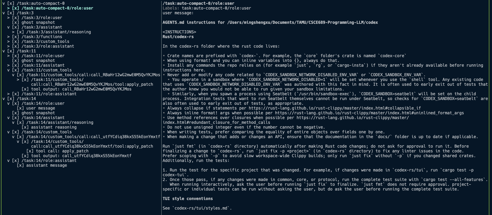

# Tree-Codex

## Purpose
1. Provide transparent, user controlled context for LLM sessions so people can see what the agent remembers and curate it before each turn.
2. Let people decide which information is preserved, summarized, or discarded across tasks instead of relying only on automatic retrieval and compaction.

## Context Tree Feature

<p align="center">
  
</p>

Once you have a running turn, open the prompt context inspector to explore and prune what the agent will send next. 
- Trigger `/context` (or choose _Context_ from the slash-command list) inside the composer.
- Navigate with ↑/↓ (or `j`/`k`) and collapse/expand with ←/→ (or `h`/`l`); press Space/Enter to toggle a node.
- Press `s` to save your visibility edits, or `q`/Esc to exit without changing anything.
Use this overlay to review the prompt context tree rooted at your session before posting another message.

## Quick Start

1. **Clone the repository and install the Rust toolchain.**  
   ```bash
   git clone https://github.com/XuMingSheng/direct-codex.git
   rustup install stable
   rustup component add rustfmt clippy
   ```

2. **Build the binary.**  
   ```bash
   cargo build --release --bin codex
   ```
   After it finishes, you can copy the produced `target/release/codex` executable elsewhere (for example, into another workspace or a location on your PATH) and start it from that directory without rebuilding.

3. **Run Codex.**  
   ```bash
   ./target/release/codex
   ```
   If you copied the binary to another directory (per step 2) you can start it there instead.


## Configuration

Codex loads `config.toml` from `$CODEX_HOME` (defaults to `~/.codex/config.toml`) plus any managed layers, and you can override individual keys with `--config` or the `-c` shortcut when launching the CLI. The file already exposes the usual `model`, `model_provider`, and feature flags from upstream, but this fork also lets you tune the context-tree summarizer.

To have the summarizer talk to a model instead of relying on the built-in heuristics, set the optional `ctx_model`/`ctx_model_provider` entries in your config. For example:

```toml
ctx_model = "gpt-5.1-codex"
ctx_model_provider = "openai"
```

With these keys set, the summarizer will consult that provider when it needs to produce node summaries; if they remain unset, it still works but only uses the built-in heuristics without extra API calls. `ctx_model_provider` defaults to whatever `model_provider` your session already uses, so you can omit it if you just want to reuse your primary provider.
